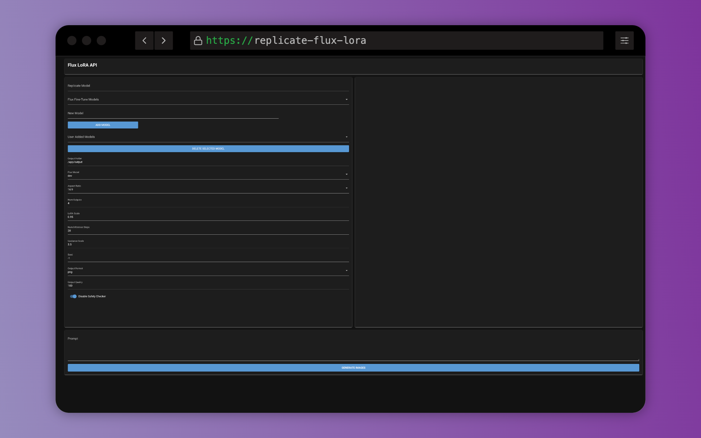

# Flux LoRA Image Generator 🚀



A powerful and user-friendly GUI application for generating images using the Replicate API and Flux LoRA models. This tool provides an intuitive interface for controlling various parameters of image generation, making it accessible for both beginners and advanced users.

## Features

- 🖼️ Generate images using the Replicate API and custom Flux LoRA models
- 💾 Save generated images to a specified output folder
- 🔑 Secure API key management through the UI
- 🖥️ User-friendly GUI
- 🐳 Docker support for easy deployment
- 📊 Model management for adding and removing Replicate models
- 🔄 Asynchronous image generation and download

## Installation

Docker is the recommended way to run this application. Follow these steps to get started:

1. Ensure you have Docker and Docker Compose installed on your system.

2. Create a new directory for the project and navigate to it.

3. Create a `docker-compose.yml` file with the following content:

   ```yaml
   services:
     replicate-flux-lora:
       image: ghcr.io/rtuszik/replicate-flux-lora:latest
       container_name: replicate-flux-lora
       ports:
         - "8080:8080"
       volumes:
         - ${HOST_OUTPUT_DIR}:/app/output
       restart: unless-stopped
   ```

4. Replace `/path/to/your/output/directory` with the actual path where you want to save the generated images on your host machine.

5. Run the application using Docker Compose:

   ```bash
   docker-compose up -d
   ```

6. Access the application at `http://localhost:8080`

## Usage

1. Open the application in your web browser at `http://localhost:8080`.
2. Set up your Replicate API key in the settings (see [API Key Setup](#api-key-setup)).
3. Add a Replicate LoRA model and select it from the dropdown.
4. Adjust the generation parameters (Flux Model, Aspect Ratio, Number of Outputs, etc.).
5. Enter your prompt in the text area at the bottom.
6. Click "Generate Images" to start the generation process.
7. View and download the generated images from the gallery on the right side of the interface.

## Fine-Tuning

In order to fine-tune you own model, please check out Replicate's guide on fine-tuning Flux:
<https://replicate.com/blog/fine-tune-flux>

## API Key Setup

To use this application, you need a Replicate API key. Follow these steps to set it up:

1. Sign up for an account at [Replicate](https://replicate.com/).
2. Generate an API key in your account settings.
3. In the application UI, click the settings icon in the top right corner.
4. Enter your API key in the provided field and save the settings.

The API key will be stored and used for subsequent requests.

## Contributing

Contributions are welcome! Please feel free to submit a Pull Request.

## License

[GPLv3](LICENSE)

---

