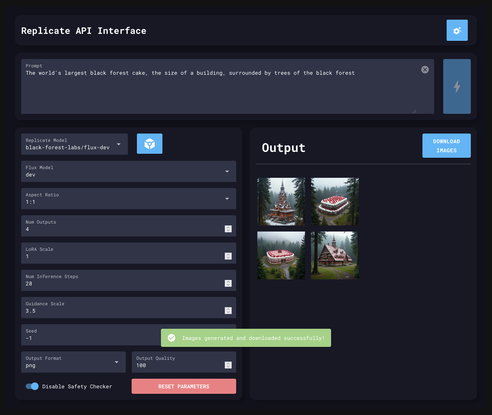

# Flux LoRA Image Generator 🚀



A powerful and user-friendly GUI application for generating images using the Replicate API and Flux LoRA models. Built with NiceGUI, this tool provides an intuitive interface for controlling various parameters of image generation, making it accessible for both beginners and advanced users.

## Features

- 🖼️ **Image Generation**: Generate images using the Replicate API and custom Flux LoRA models
- 💾 **Flexible Output**: Save generated images to a specified output folder or download through your browser
- 🖥️ **Modern GUI**: Clean, responsive web interface built with NiceGUI and dark mode support
- 🐳 **Docker Support**: Easy deployment with Docker and Docker Compose
- 📊 **Model Management**: Store and quickly switch between multiple Replicate models
- 🔄 **Async Processing**: Asynchronous image generation and download for better performance
- ⚙️ **Advanced Parameters**: Fine-tune generation with aspect ratio, inference steps, guidance scale, and more
- 🔧 **Robust Architecture**: Modular codebase with proper error handling and logging
- 📦 **Modern Dependency Management**: Support for both pip/venv and uv package manager
- 🔍 **Code Quality**: Linted with Ruff and follows Python best practices

## Installation

### Docker (Recommended)

Docker is the recommended way to run this application. Follow these steps to get started:

1. Ensure you have Docker and Docker Compose installed on your system.

2. Create a new directory for the project and navigate to it.

3. Create a `docker-compose.yml` file with the following content:

    ```yaml
    services:
        replicate-flux-lora:
            image: ghcr.io/rtuszik/replicate-flux-lora:latest
            container_name: replicate-flux-lora
            ports:
                - "8080:8080"
            volumes:
                - replicate-flux-lora-settings:/app/settings
                - ${HOST_OUTPUT_DIR}:/app/output
            restart: unless-stopped
    volumes:
        replicate-flux-lora-settings:
    ```

4. Replace `/path/to/your/output/directory` with the actual path where you want to save the generated images on your host machine.

5. Run the application using Docker Compose:

    ```bash
    docker-compose up -d
    ```

6. Access the application at `http://localhost:8080`

### Local Development

For local development, you can run the application directly with Python. The project supports both traditional pip/venv and modern uv package manager.

#### Option 1: Using uv (Recommended)

1. Install [uv](https://docs.astral.sh/uv/):

    ```bash
    curl -LsSf https://astral.sh/uv/install.sh | sh
    ```

2. Clone the repository:

    ```bash
    git clone https://github.com/rtuszik/replicate-flux-lora.git
    cd replicate-flux-lora
    ```

3. Install dependencies and run:
    ```bash
    uv sync
    uv run python src/main.py
    ```

#### Option 2: Using pip and venv

1. Clone the repository:

    ```bash
    git clone https://github.com/rtuszik/replicate-flux-lora.git
    cd replicate-flux-lora
    ```

2. Create and activate a virtual environment:

    ```bash
    python3 -m venv .venv
    source .venv/bin/activate  # On Windows: .venv\Scripts\activate
    ```

3. Install dependencies:

    ```bash
    pip install -r requirements.txt
    ```

4. Run the application:

    ```bash
    python3 src/main.py
    ```

5. Access the application at `http://localhost:8080`

## Usage

1. Open the application in your web browser at `http://localhost:8080`.
2. Set up your Replicate API key in the settings (see [API Key Setup](#api-key-setup)).
3. Add a Replicate LoRA model and select it from the dropdown.
4. Adjust the generation parameters (Flux Model, Aspect Ratio, Number of Outputs, etc.).
5. Enter your prompt in the text area at the bottom.
6. Click "Generate Images" to start the generation process.
7. View and download the generated images from the gallery on the right side of the interface.

## Fine-Tuning

In order to fine-tune you own model, please check out Replicate's guide on fine-tuning Flux:
<https://replicate.com/blog/fine-tune-flux>

## API Key Setup

To use this application, you need a Replicate API key. Follow these steps to set it up:

1. Sign up for an account at [Replicate](https://replicate.com/).
2. Generate an API key in your account settings.
3. In the application UI, click the settings icon in the top right corner.
4. Enter your API key in the provided field and save the settings.

The API key will be stored and used for subsequent requests.

## Contributing

Contributions are welcome! Please feel free to submit a Pull Request.

## License

[GPLv3](LICENSE)

---
